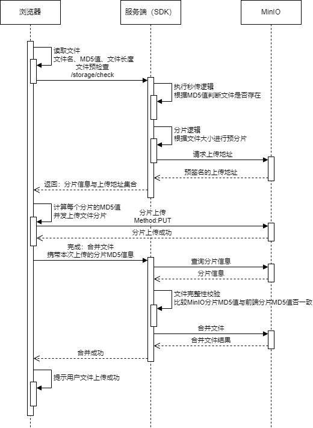

# Upload

/TODO Upload Process Activity Diagram

## file transfer in seconds

When users repeatedly upload the same file, a complete file upload operation is required each time, which leads to redundancy in the file upload process, wasting users' time and server network IO, and occupying unnecessary server disk space with duplicate files. 
To address these two issues, minio-plus supports the instant upload feature, which solves the problem of repeated file uploads in traditional file uploads, improves file transfer efficiency and user experience, and reduces the storage space usage of the file server. 
The main technical issues involved in implementing instant upload are generating a unique identifier for the file and detecting file duplication.

* File Unique Identifier Generation: On the browser side, the MD5 hash algorithm is used to encode the file being transferred. The encoding result is a string that serves as the file's unique identifier.
* File Duplication Detection: On the server side, the received file unique identifier is searched in the database. If the same file unique identifier is found in the database, it is determined that the file exists and does not need to be transferred again.

### Chunked Upload

Chunked upload is a technique that divides large files into multiple segments for concurrent or sequential upload. It offers several benefits:

* Improved Transfer Speed: When uploading a large file, dividing it into chunks and uploading multiple chunks concurrently, rather than uploading the entire large file sequentially, can maximize bandwidth utilization and thus speed up the upload.
* Support for Resumable Upload: Chunked upload is a prerequisite for resumable upload technology. To implement resumable upload, chunked upload must be supported first.

## Resumable Upload

Resumable upload relies on chunking technology and is an important means to improve availability. Its advantages include:

* Saving Time, Reducing Network IO, and Reducing Disk IO: When a file transfer encounters issues and fails, only the unfinished chunks need to be retransmitted, rather than restarting the entire transfer task.
* Increased Transfer Reliability: It can prevent the entire file from needing to be retransmitted due to network fluctuations or other reasons. No longer afraid of unexpected network disconnection. Especially useful for large file transfers.
* Pause and Resume Anytime: Users can pause or interrupt the transfer during the process, and resumable upload allows for convenient recovery of the transfer task.

/TODO Resumable Upload Sequence Diagram