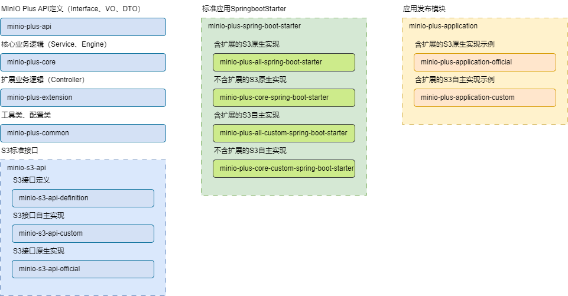

# Code Structure

The project is positioned as a Java language SDK for MinIO, not as a standalone deployment service, and supports automatic assembly with Spring Boot. Users are responsible for implementing the data storage part, with the project providing a default MySQL implementation.

## Module Division

* **minio-plus-api**: The interface definitions for the capabilities provided externally by MinIO Plus, can be understood as the Service layer interface definitions.
* **minio-plus-core**: The core business logic package, can be understood as the implementation of the interfaces in the minio-plus-api package.
* **minio-plus-extension**: The extension package, encapsulates Controller-related interfaces, can be understood as the Controller layer encapsulation of the interfaces in the minio-plus-api package, helping the project to be used out-of-the-box.
* **minio-plus-common**: Utility and configuration classes package.
* **minio-s3-api**
  * **minio-s3-api-definition**: Interface definitions for the S3 specification used by MinIO Plus.
  * **minio-s3-api-official**: Native SDK implementation.
  * **minio-s3-api-custom**: Self-implemented.
* **minio-plus-spring-boot-starter**
  * **minio-plus-all-spring-boot-starter**: Includes core, extension, common, and api.
  * **minio-plus-core-spring-boot-starter**: Includes core, common, and api.
* **minio-plus-application**
  * **minio-plus-application-official**: Example project using the native MinIO SDK and metadata with MySQL database.
  * **minio-plus-application-custom**: Example project using self-implemented S3 specification and data with MySQL database.