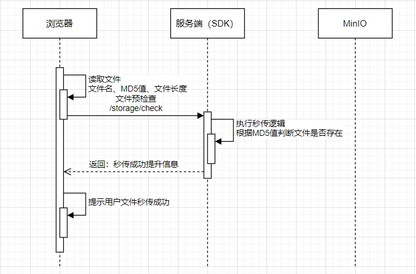

# 上传

/TODO 上传流程活动图

## 秒传

当用户重复上传相同的文件时，每次都需要执行一次完整的文件上传操作，这造成了文件上传过程的冗余，即浪费了用户的时间和服务器的网络IO，重复文件又占用了不必要的服务器磁盘空间。
针对以上两个问题，minio-plus支持文件秒传特性，解决了传统文件上传中重复文件上传时的问题，提高了文件传输的效率和用户体验，同时减少了文件服务器的存储空间占用。
实现文件秒传的技术问题主要涉及文件唯一标识的生成和文件重复性检测。

* 文件唯一标识生成：在浏览器端，使用MD5哈希算法对待传输文件进行哈希值编码。编码结果为一字符串，作为文件的唯一标识。
* 文件重复性检测：在服务器端，根据接收到的文件唯一标识在数据库中进行搜索。如果在数据库中找到相同的文件唯一标识，那么判断该文件存在且无需再进行文件传输。

## 分片上传

分片上传是一种将大文件划分为多个片段并发或按序上传的技术。它有以下几个好处：

* 提高传输速度：当上传的文件比较大时，将大文件进行分块，同时并发上传多个小块，而不是一整个大文件按顺序上传。这样可以最大限度地利用带宽，从而加快上传速度。
* 支持断点续传：分块上传是断点续传技术的前置条件，要想实现断点续传，必须先支持分块。

## 断点续传

断点续传依赖于分片技术，是提高可用性的重要手段，优点如下：

* 节省时间、减少网络IO、减少磁盘IO：在文件传输过程中遇到问题导致传输失败时，只需重新传输未完成的分片，而不需要重新开始整个传输任务。
* 增加传输的可靠性：可以避免由于网络波动或其他原因导致整个文件需要重新传输的情况。再也不怕意外断网。在大文件传输时，尤其有用。
* 随时暂停和恢复：用户可以在传输过程中暂停传输或者中断传输，断点续传可以方便地恢复传输任务。

/TODO 断点续传时序图